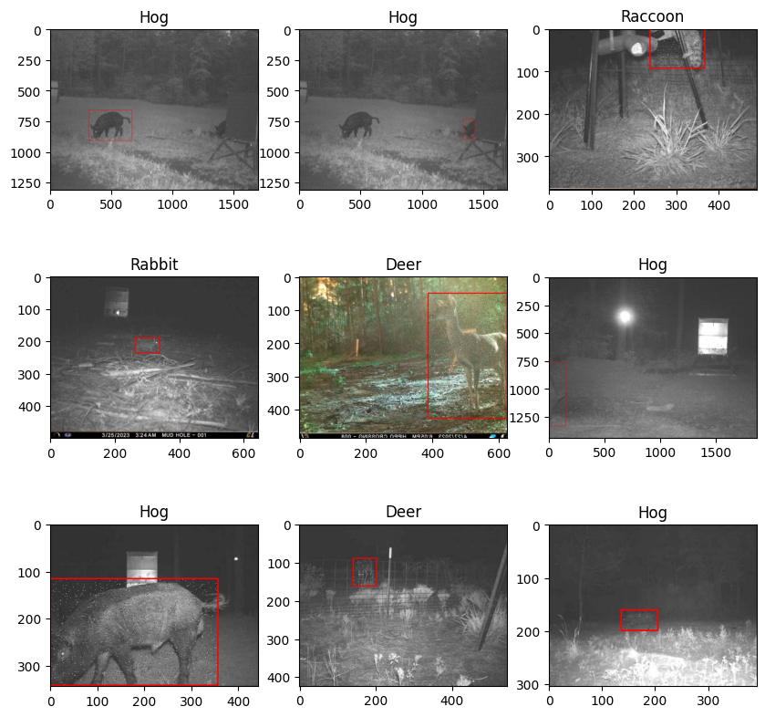

# Object-Detection-with-Bounding-Box

This repository contains code and resources for implementing object detection with bounding boxes. The goal of this project is to provide a flexible and efficient solution for detecting objects in images and annotating them with bounding boxes.

## Dataset 
My Games Pic dataset from roboflow is used in this project, can be downloaded from https://universe.roboflow.com/my-game-pics/my-game-pics

It contains 9724 images divided into train, valid and test folders.

<div align="center">
  <a href="https://github.com/SabihShah/Object-Detection-with-Bounding-Box">
    
  </a>

## Built With
- Tensorflow
- Keras
- openCV
- matplotlib
- pandas
- numpy

## Getting Started
```sh
pip install requirements.txt
```
```sh
git clone https://github.com/SabihShah/Object-Detection-with-Bounding-Box.git 
```
